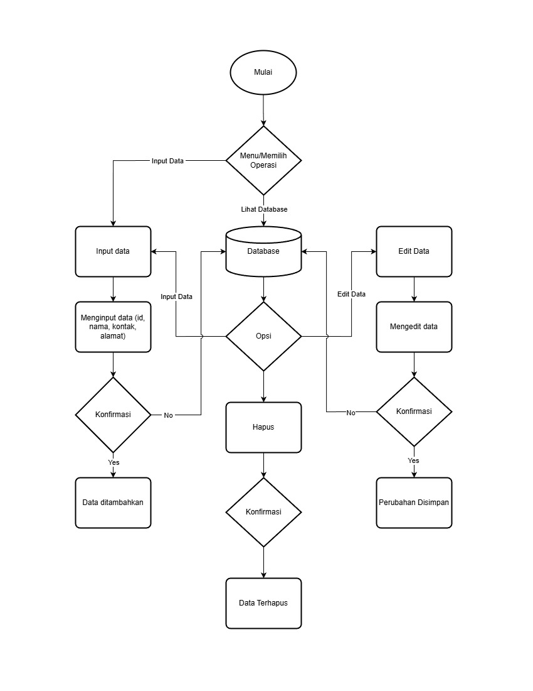

# My Address Book

## Deskripsi

My Address Book adalah aplikasi sederhana untuk mengelola data kontak pribadi.  
Aplikasi ini memungkinkan pengguna untuk menambahkan, melihat, mengedit, dan menghapus data kontak dengan mudah.

Tujuan dari proyek ini adalah untuk memahami dasar pembuatan aplikasi CRUD berbasis web.

Demo aplikasi:  
[Vercel](https://testabs.vercel.app/)

---

## Fitur Utama

- Input Data: Menambahkan data kontak baru seperti nama, nomor telepon, dan alamat.
- Lihat Data: Menampilkan seluruh data kontak yang tersimpan.
- Edit Data: Mengubah informasi kontak yang sudah ada.
- Hapus Data: Menghapus data kontak yang tidak diperlukan.

---

## Teknologi yang Digunakan

- HTML untuk struktur halaman.
- CSS untuk tampilan antarmuka.
- JavaScript untuk logika program dan interaksi pengguna.

---

## Proses Pengembangan

### Minggu 1

- Membuat README.md untuk mendeskripsikan proyek.
- Mendesain flowchart sistem sebagai gambaran alur kerja aplikasi.

---

## Flowchart

---

## Catatan

Proyek ini dibuat untuk tujuan pembelajaran dalam memahami dasar manajemen data dan logika program menggunakan CRUD sederhana berbasis web.

# testabs
